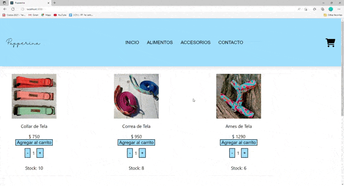

# Pupperina 

Pupperina es un emprendimiento familiar dedicado a la elaboracion y venta de accesorios para mascotas y otros productos.

Se decidio realizar una tienda online, no solo con el objetivo de tener una mayor visibilidad, sino tambien para dar una mayor comodidad a los clientes y poder llegar a todo el pais.

Para desarrollar la tienda se utilizo React JS, como tambien alguna dependencias, tales como:

React-bootstrap V. 2.4.0
Bootstrap V. 5.1.3
Font-awesome V. 4.7.0 
React Router Dom V. 18.2.0 
Firebase V. 9.9.3

## Instalacion

Primero debe clonar el repositorio en su computadora y posteriormente desde la terminal instalar las dependecias con el comando

### `npm instal`

Luego lo puede ejecutar con el comando:

### `npm start`

